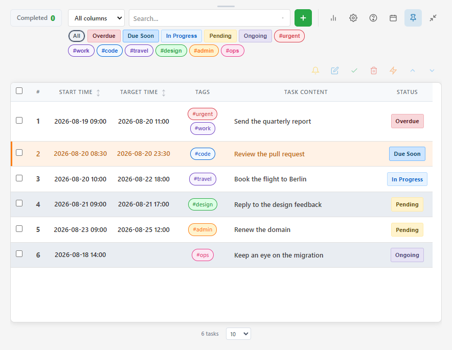
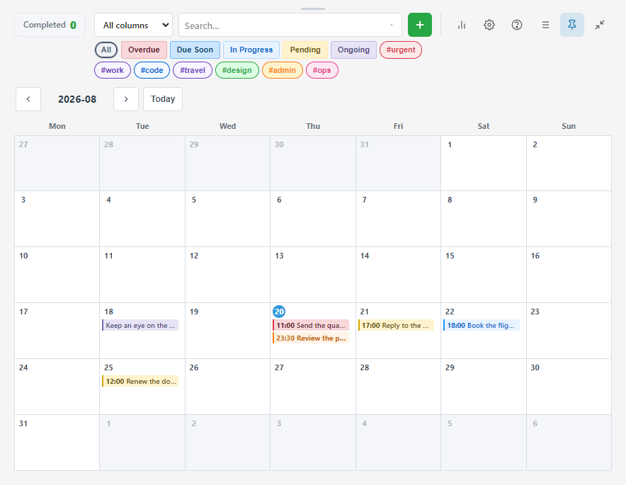
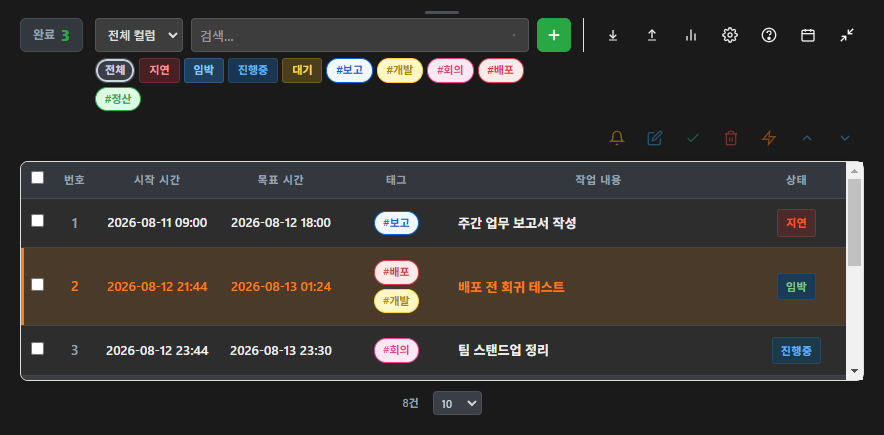
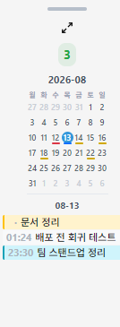

# Tasktory

[](https://github.com/planyist/tasktory/actions/workflows/ci.yml)

A compact, always-on-top task manager. It sits in the corner of your screen like
a sticky note so the things you have to do stay visible while you work.

It exists to solve one problem: when you are busy, you forget what you were
meant to do — and you forget what you already did. Tasktory keeps both.



Colours carry the status, so a glance is enough: overdue, due soon, in progress,
pending. The row you highlighted stays highlighted.

<table>
<tr>
<td width="50%"></td>
<td width="50%"></td>
</tr>
<tr>
<td>A month at a time, to see where the work piles up.</td>
<td>Dark mode throughout.</td>
</tr>
</table>



Collapsed, it becomes a 150px strip that stays out of the way — today's work in
time order, with a mini calendar above it. Ctrl+M toggles it.

<br clear="right">

## Features

### Tasks

- **Always-on-top** window, so the list does not disappear behind your work —
  including through Win+D (show desktop), the way a sticky note would
- **Add, edit, complete, delete, highlight, reorder** — select rows and use the
  action bar above the table
- **Multi-select**: tick several rows and act on all of them at once. The header
  checkbox selects everything currently filtered, not just the visible page
- **Page size**: 10, 20, 50 or 100 rows, chosen beside the pager, with the total
  count alongside
- **Optional target time**: a task without one is *ongoing* — never overdue,
  never "due soon", and it raises no notifications
- **Repeating tasks**: daily, weekly, monthly or yearly. One row *is* the rule
- **Highlight** anything you want to keep your eye on
- **Tags** with colours, and a preset list for the ones you use often

### Views

- **List** — the table. Everything you can do to a task happens here
- **Calendar** — a month grid; a task shows on every day it spans. View-only
- **Side strip** — 150px, read-only, for when you want it out of the way

### Finding things

- Search as you type, optionally **scoped to one column**
- **Click a chip** — a tag, a status, a repeat cadence — to filter by it
- **Quick filters** under the search box: the statuses and tags actually in use

### History

- Every action is logged — added, completed, edited, deleted, and more
- One tab-separated file per day, so a spreadsheet opens it directly
- A **daily completion counter** — hover it to see *what* you finished today
- A 30-day chart of completion trends
- **Export/import** for backup, or for moving to another machine

### The rest

- **Always-on-top can be turned off** in settings, if you would rather it
  behaved like an ordinary window
- **Dark mode**
- **Five languages**: English, Korean, Chinese, Japanese, Spanish
- **Configurable date format** — the display changes, the stored data does not
- **Notifications** an hour and fifteen minutes before a deadline, and when one
  passes. Can be silenced per task
- **Installable on a phone** as a PWA, and it opens offline

## Installation

### Run from source

```bash
git clone https://github.com/planyist/tasktory.git
cd tasktory
npm install
npm start
```

### Build an executable

```bash
npm run build:win     # Windows (.exe)
npm run build:mac     # macOS (.dmg)
npm run build:linux   # Linux (.AppImage)
```

Output goes to `dist/`.

### In a browser

Open `index.html` — the same app, minus the parts that need a desktop:
no always-on-top and no log files, with tasks kept in `localStorage`. Use
export/import to move them. Served over http(s) it also installs as a PWA and
opens offline.

## Usage

### The action bar

Rows carry no buttons. Tick the rows you want and use the bar above the table:

| Button | What it does |
|---|---|
| Bell | Silence or unsilence notifications |
| Pencil | Edit — needs exactly one row selected |
| Check | Complete. Asks first, and lets you set the completion time |
| Bin | Delete. Asks first |
| Bolt | Highlight |
| Up / down | Reorder — needs exactly one row selected |

**Double-click a row** to open it for editing.

Clicking **anywhere in a row** selects it. Tags and status chips are the
exception: clicking those filters the list instead.

With several rows selected, the two toggles gather the whole selection onto one
state rather than flipping each row on its own. If any selected task is not
highlighted, they all become highlighted; only when every one already is does
pressing again clear them. Notifications work the same way around muting.

### Repeating tasks

Set a repeat in the task's edit form. The row then *is* the rule:

- Completing it does not remove the row. Its two dates are rewritten to the next
  occurrence, and since the status is worked out from the dates, the task
  usually goes back to Pending. Two occurrences behind means it is still Overdue
  after one press
- Completing advances **one** step. A task five occurrences overdue takes five
  presses, and each is logged, so the history stays honest. To skip ahead, edit
  the date
- Deleting the row deletes the repeat rule with it
- Month ends are clamped: a "31st of each month" rule fires on 28/29 February
- A task with no target time cannot repeat
- **Until**: set an end date to stop the repeat there. Leave it empty and it
  carries on indefinitely. The last occurrence completes like any other task

### Calendar view

Toggle it with the calendar button at the top right, next to collapse.

- A task sits on its **target day** — the deadline, not every day from start to
  finish. The start time is usually just when you noted it down
- The time shown is the target time, and each day sorts by it
- A task with no target time has no length to draw, so it sits at the top of its
  start day without a time
- Colours match the table's status badges
- **View-only.** Nothing in a cell is clickable — the list does all of that

Collapsed, it becomes a mini month grid — 150px is too narrow for task names,
so each day shows its number and a coloured underline for its most pressing
status, with that day's items listed underneath. Today is a filled circle. If
today is clear the strip rolls forward to the next day with work, and that day
gets a ring so you can see the two are different. **Click any date** to list it
instead; click it again to go back to automatic.

### Search and filters

The dropdown beside the search box narrows the search to one column, so
searching "overdue" under *Status* will not also match a task with the word in
its title.

Clicking a chip in the table sets both the search text and the column.

The quick filter row under the search box works differently: the chips are
**toggles and you can hold several at once**. Two tags means either tag; a tag
plus a status means both must match. It lists the statuses and tags actually in
use, up to 15, most-used first. **All** clears the filters and the search
together.

Tags you type yourself get a colour derived from their name, so two different
tags never look alike. Give one an explicit colour with `#[RED]name`.

### Statuses

| Status | Meaning |
|---|---|
| Pending | Before the start time |
| In Progress | Between start and target |
| Due Soon | Less than an hour to the target |
| Overdue | Past the target time |
| Ongoing | No target time — never overdue, never due soon |
| Completed | Done |

### Tags

```
#meeting #urgent                       plain
#[RED]urgent #[GREEN]done #[BLUE]spec  coloured
```

Colours: `RED`, `GREEN`, `BLUE`, `YELLOW`, `PURPLE`, `ORANGE`, `GRAY`, `PINK`.

### Keyboard shortcuts

- `Ctrl/Cmd + N` — add a task
- `Ctrl/Cmd + M` — collapse to the side strip and back
- `Esc` — close a dialog or the date picker

### Moving the window

The title bar is thin, and at 150px there is almost nothing left of it. Use the
grip at the very top of the window instead — it is there in both sizes.

## Where your data lives

Under Electron, in the app's user-data directory:

```
data/tasks.json      active tasks
data/rules.json      repeat rules
logs/YYYY-MM-DD.tsv  one history file per day, by local date
```

Completing a task removes it from `tasks.json`. The history lives in the daily
log, whose `COMPLETE` line already records the id, both times, the tags and the
content — so keeping a second copy only grew the file and every backup. A
repeating task is the exception: its row is the rule, so it stays and moves on
to its next occurrence.

The log columns are `TIMESTAMP ACTION STATUS TASK_ID START_TIME TARGET_TIME
TAGS CONTENT`. `TIMESTAMP` carries the UTC offset, because a log is a permanent
record and without the offset the zone cannot be recovered later. `START_TIME`
and `TARGET_TIME` deliberately do not — they express wall-clock intent, not an
instant.

Times are stored as `YYYY-MM-DD HH:mm` whatever display format you pick, so
changing the setting never rewrites your data.

In a browser, everything lives in `localStorage`; use export/import to move it.

## Development

```bash
npm install
npm start        # run it
npm test         # Jest
npm run check:ui # layout and theme checks in a real Electron window
npm run build    # package for the current platform
```

### Project layout

```
main.js                  Electron main process, IPC handlers, log writing
preload.js               the bridge between main and renderer
index.html               UI structure
renderer.js              all client-side logic (one TaskManager class)
styles.css               styling, light and dark
recurrence.js            pure date maths for repeat rules
manifest.json            PWA manifest
service-worker.js        offline cache
register-sw.js           service-worker registration (skipped under file://)
tests/                   Jest suite
__mocks__/               manual electron mock for main-process tests
assets/                  icons
docs/                    design notes, including a sync proposal (not built)
```

**Adding a source file?** Add it to `build.files` in `package.json` — that list
is an allowlist, not a filter. A file missing from it is missing from the
packaged app, and running from source hides that completely.

### Technology

Electron 32, plain HTML/CSS/JavaScript, no framework. Data in JSON, history in
TSV, IPC isolated behind a preload bridge with a Content Security Policy.

## License

MIT — see [LICENSE](LICENSE).

## Contributing

Fork, branch, change, open a pull request. A bug fix should come with a test
that fails before the change and passes after.

Issues: https://github.com/planyist/tasktory/issues
